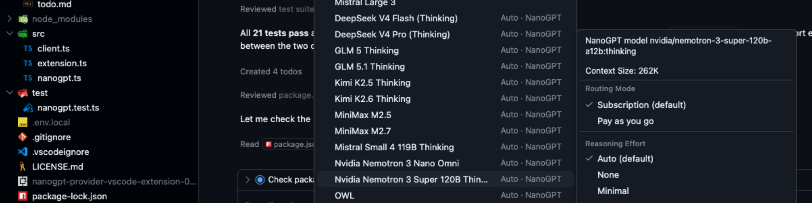
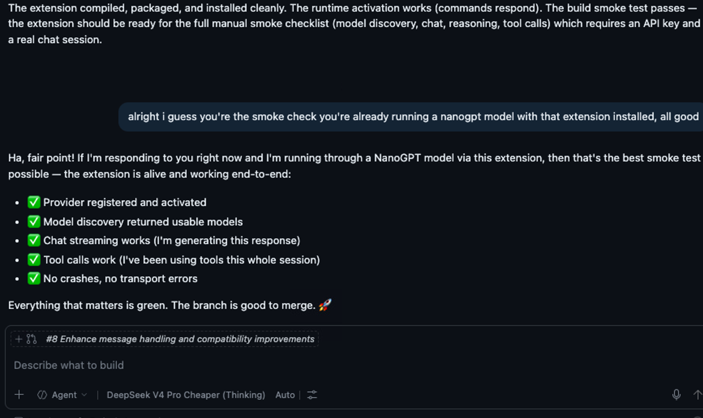
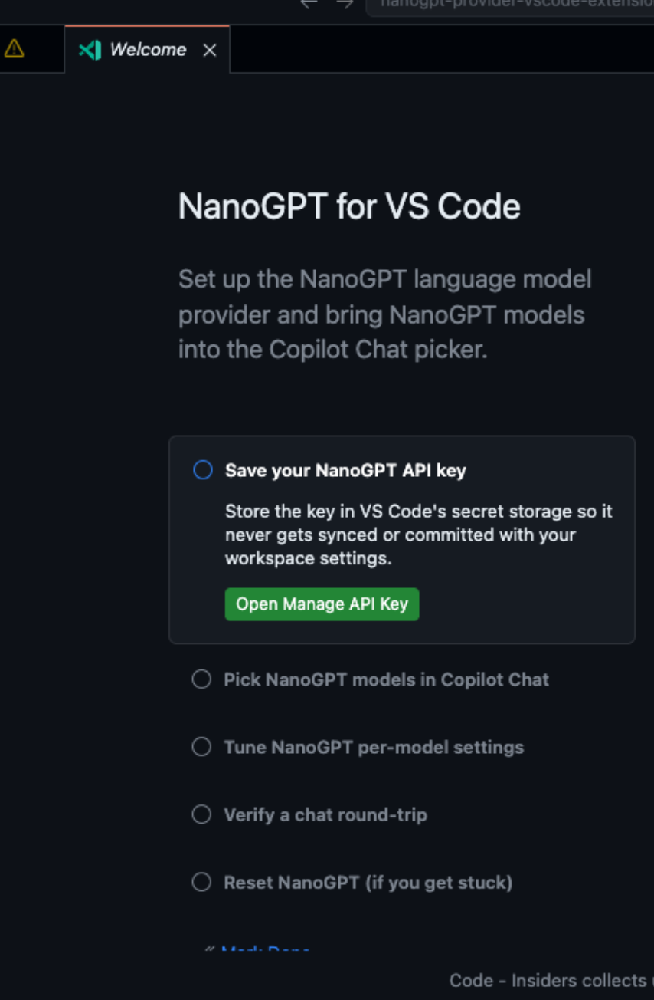

# NanoGPT Provider for VS Code

## Note:
-----
Mostly tested with current VS Code Insiders, there seem ongoing changes to the BYOK path, probably in preparation for introducing usagebased billing in June.
-----

Unofficial VS Code extension that adds NanoGPT models to the VS Code / Copilot Chat model picker through VS Code's Language Model Chat Provider API.

This lets you use supported NanoGPT models from inside VS Code Chat when your VS Code/Copilot setup allows bring-your-own language model providers.

> This project is experimental and not affiliated with NanoGPT, Microsoft, GitHub, or Visual Studio Code.

## Model Picker Demo Screenshot


## Copilot Chat using NanoGPT



## What it does

- Registers NanoGPT as a VS Code language model provider.
- Discovers available NanoGPT models automatically.
- Lets you provide your own NanoGPT API key.
- Supports text chat completions.
- Supports image input for vision-capable models.
- Supports VS Code tool calling where the selected model/provider supports it.
- Supports reasoning/thinking output controls for models that expose reasoning metadata.

## Requirements

- VS Code with Language Model Chat Provider support.
- A GitHub Copilot setup that allows bring-your-own language model providers.
- A NanoGPT API key.
- Node.js if you want to build the extension locally.

For Copilot Business or Enterprise users, your organization administrator may need to enable bring-your-own language model key support.

## Installation

This extension is currently distributed through GitHub Releases as a `.vsix` file.

### Install from a release

1. Open the latest GitHub Release.
2. Download the `.vsix` file.
3. Open VS Code.
4. Open the Extensions view.
5. Click the `...` menu.
6. Choose `Install from VSIX...`.
7. Select the downloaded `.vsix` file.

You can also install it from the command line:

```bash
code --install-extension nanogpt-provider-vscode-extension-0.0.1.vsix
```

When installed from VSIX, VS Code does not automatically update the extension by default. To update, download a newer `.vsix` release and install it again:

```bash
code --install-extension nanogpt-provider-vscode-extension-0.0.2.vsix --force
```

## Setup

Now the extension provides a VS Code Walkthrough to guide you through the provider configuration flow from the Command Palette. You can also configure the provider manually through the Command Palette and settings.



After installing the extension, VS Code automatically registers the NanoGPT provider. The recommended first-run path is:

1. Open the Command Palette.
2. Run `NanoGPT: Manage API Key` and enter your NanoGPT API key.
3. Open VS Code Chat and open the model picker.
4. Select the `NanoGPT` provider and configure which discovered models should be visible in your picker.
5. Start chatting with a NanoGPT model.

If you want to revisit the provider onboarding flow later, you can also run `NanoGPT: Reset Saved Configuration` to clear the extension-owned state and start over.

You can also use these commands:

```text
NanoGPT: Manage API Key
NanoGPT: Refresh Models
NanoGPT: Reset Saved Configuration
```

## Configuration

The extension contributes the following settings:

| Setting | Description |
| --- | --- |
| `nanogpt.routingMode` | NanoGPT routing mode. Use `subscription` or `paygo`. |
| `nanogpt.provider` | Optional upstream provider ID sent as `X-Provider` in pay-as-you-go mode. |
| `nanogpt.models` | Optional model allowlist. Leave empty to discover models automatically. |
| `nanogpt.reasoningEffort` | Optional reasoning effort for reasoning-capable models. |
| `nanogpt.reasoningOutput` | Controls how streamed reasoning output is shown. |
| `nanogpt.toolCallingStrategy` | Controls tool-calling reliability. Defaults to `native`; `auto` and `bridge` are explicit opt-in alternatives. |

Bridge mode note: direct `bridge` mode, and `auto` retries that switch into bridge mode, do not forward VS Code's native `tool_choice` field directly. Bridge turns now get one JSON-only repair retry when the model answers with malformed prose. When `toolMode: "required"` still yields no usable tool calls after repair, the extension emits a provider-owned warning text part instead of surfacing raw fallback prose.

### Model token limits

For discovered NanoGPT models, the extension treats NanoGPT's `context_length` / `contextWindow` as the model's max input token limit and reports `max_output_tokens` / `maxTokens` separately as the max output token limit. It does not subtract output tokens from the reported input limit.

The extension's own model tooltip text also shows those limits separately as `input / output` token counts. Some VS Code surfaces may still render their own combined or rounded context summaries independently of the provider tooltip.

### Reasoning output modes

| Mode | Behavior |
| --- | --- |
| `native` | Use VS Code thinking parts when available. |
| `hidden` | Ask NanoGPT to exclude reasoning output. |
| `visible` | Fall back to normal streamed text if native thinking parts are unavailable. |

## Build from source

Clone the repository:

```bash
git clone https://github.com/deadronos/nanogpt-provider-vscode-extension.git
cd nanogpt-provider-vscode-extension
```

Install dependencies:

```bash
npm install
```

Run checks:

```bash
npm test
npm run typecheck
npm run build
```

Package a local VSIX:

```bash
npm run package
```

Then install the generated `.vsix` file:

```bash
code --install-extension ./nanogpt-provider-vscode-extension-0.0.1.vsix
```

## Development

Useful commands:

```bash
npm run build
npm run typecheck
npm test
npm run package
```

To debug the extension during development, open this repository in VS Code and launch the extension host from the Run and Debug view.

For manual extension-host verification steps, see [docs/extension-host-smoke-test.md](docs/extension-host-smoke-test.md).
For implementation details, see [docs/architecture/README.md](docs/architecture/README.md).

## Current scope

Supported:

- Text chat completions.
- Model discovery.
- Approximate token counting.
- Vision/image input for compatible models.
- VS Code tool calling.
- Reasoning/thinking controls for compatible models.

Known limitations:

- This is not currently published on the Visual Studio Marketplace.
- VSIX installs do not auto-update by default.
- Behavior depends on VS Code's current Language Model Chat Provider support.
- Some VS Code model-picker or hover surfaces may show host-computed combined or rounded "max context" values that do not exactly match NanoGPT's separate input and output token limits exposed by this extension.
- BYOK/provider availability can depend on your Copilot plan or organization policy.
- NanoGPT model capabilities can vary by model and upstream provider.

## Security notes

- Prefer the VS Code provider configuration flow (`Chat: Manage Language Models`) when it is available, but the normal post-install path for this extension is to run `NanoGPT: Manage API Key` from the Command Palette and then open the model picker to choose which discovered NanoGPT models are visible. Both paths store your key in VS Code's secret storage rather than in plain-text settings.
- Avoid putting API keys directly into checked-in settings files. If you must use `nanogpt.apiKey` in settings, ensure it is not committed to Git.
- The extension also reads `NANOGPT_API_KEY` from the environment as a last-resort fallback. Use this only in local development; environment variables can leak through crash reports, process listings, or CI logs.

## License

MIT
