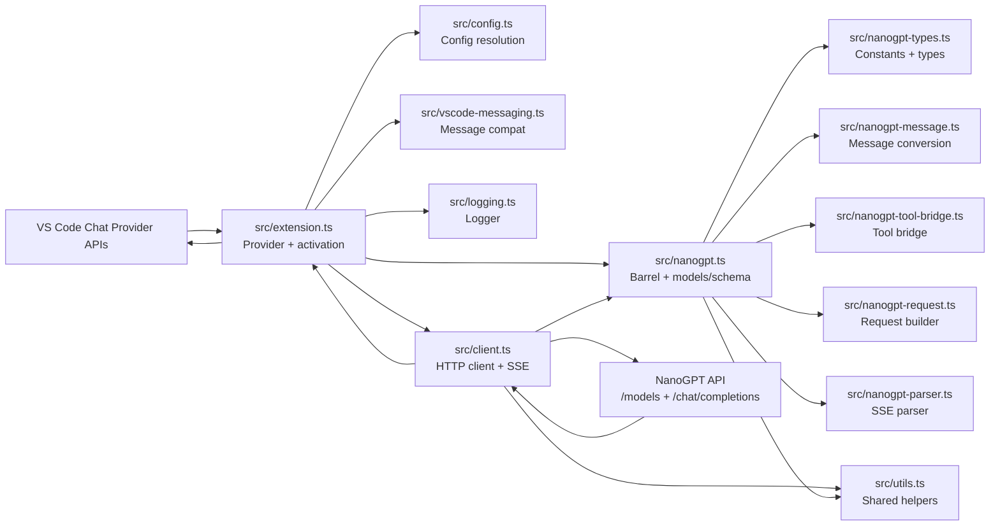

# Current Architecture

This document describes the architecture that is implemented today, not a proposed future design.

## System Goal

The extension registers NanoGPT as a VS Code Language Model Chat Provider so NanoGPT-backed models can appear in the Copilot Chat model picker and participate in VS Code chat requests.

At runtime, the extension translates between three worlds:

1. VS Code chat-provider APIs and request/response parts.
2. NanoGPT's OpenAI-compatible chat and model-discovery endpoints.
3. Internal repository contracts that separate VS Code integration, HTTP I/O, and pure transformation logic.

## High-Level Component Diagram

## Architectural Boundaries

### VS Code Integration Layer

#### `src/extension.ts`

This file is the only place that should depend on VS Code runtime APIs for provider lifecycle.

Responsibilities:

- Registers the language model chat provider under vendor id `nanogpt`.
- Registers commands: `nanogpt.manage`, `nanogpt.refreshModels`.
- Owns the `NanoGptLanguageModelProvider` class with model cache, discovery, chat streaming, token counting, and the provider-level model-change event that tells VS Code when discovery should run again.
- Bridges VS Code `CancellationToken` to `AbortSignal` via `createAbortSignal`.

#### `src/config.ts`

Responsibilities:

- Exports `DEFAULT_MODELS` fallback array (5 models spanning gpt-5.4, claude-sonnet, gemini-2.5, and deepseek families).
- Resolves all configuration from provider configuration, workspace settings, secret storage, and environment fallback.
- Provides typed getters: `getRoutingMode`, `getProvider`, `getModelAllowlist`, `getReasoningEffort`, `getReasoningOutput`, `getToolCallingStrategy`, `resolveApiKey`, `isVerboseLoggingEnabled`. The reasoning and tool-calling getters also accept an optional `modelOptions` parameter so per-request overrides win over provider configuration and workspace settings.
- `resolveApiKey` uses a two-tier safe chain by default: per-model provider configuration → VS Code secret storage. The legacy workspace-setting and env-var fallbacks are available only when explicitly opted in via `{ allowInsecureSources: true }`.

#### `src/logging.ts`

Responsibilities:

- Creates a `NanoGptLogger` backed by the VS Code `LogOutputChannel`.
- Gates verbose `trace`/`debug` levels on `nanogpt.verboseLogging`.

#### `src/vscode-messaging.ts`

Responsibilities:

- Converts VS Code `LanguageModelChatRequestMessage` → `VscodeLikeMessage` via `toCoreMessages()`.
- Maps `LanguageModelChatToolMode` via `toToolMode()`.
- Creates `LanguageModelThinkingPart` via `createThinkingPart()` — with defensive runtime feature detection.
- Handles `LanguageModelPromptTsxPart` via `getPromptTsxText()`.

### Transport Layer

#### `src/client.ts`

This file owns network transport and stream handling.

Responsibilities:

- Builds outbound HTTP calls using `buildNanoGptChatCompletionRequest()` from the core layer.
- Calls `GET {baseUrl}/models?detailed=true` and `POST {baseUrl}/chat/completions`.
- Chooses native tool calling, automatic bridge retry, or explicit bridge mode for tool-enabled turns.
- Composes timeouts with caller cancellation (via `withTimeout` from `utils.ts`).
- Reads streaming SSE responses using `NanoGptSseParser`.
- Emits typed callbacks for text, reasoning, and tool calls.
- Produces sanitized transport logs through an injected logger interface.

Key design constraints:

- No VS Code imports.
- No direct knowledge of secret storage or workspace settings.
- Logging is transport-focused and intentionally sanitized.

### Core Transformation Layer

#### `src/nanogpt-types.ts`

Pure constants and type definitions — no I/O, no VS Code.

Exports:

- `NANOGPT_BASE_URL`, `NANOGPT_SUBSCRIPTION_BASE_URL`
- All shared types: `NanoGptChatMessage`, `NanoGptRoutingMode`, `VscodeModelMetadata`, `NanoGptResponsePart`, `NanoGptRequest`, etc.
- `resolveRole()` helper.

#### `src/nanogpt-message.ts`

Pure message and tool conversion — no I/O, no VS Code.

Exports:

- `toNanoGptMessages()` — converts `VscodeLikeMessage[]` → `NanoGptChatMessage[]`.
- `toNanoGptTools()` — serializes tool definitions with 200 KB limit enforcement.
- `getTextPartValue()`, `toNanoGptImagePart()`, `toToolCall()`, `toToolResultContent()`.

#### `src/nanogpt-tool-bridge.ts`

Pure tool-calling bridge transforms — no I/O, no VS Code.

Exports:

- `buildToolCallingBridgeMessages()` — rewrites tool history into a strict JSON-only bridge contract.
- `buildToolCallingBridgeRepairMessages()` — builds a JSON-only repair follow-up turn when the bridge response was invalid, or when a `toolMode: "required"` bridge turn returned prose without a usable tool call.
- `parseToolCallingBridgeResponse()` — normalizes bridge JSON (and JSON code-fenced or XML-like `<tool_calls>` payloads) back into final text or tool-call intents.

#### `src/nanogpt-request.ts`

Pure request builder — no I/O, no VS Code.

Exports:

- `buildNanoGptChatCompletionRequest()` — assembles URL, headers, and JSON body.
- `prepareChatRequest()` — normalises messages before serialisation: strips oversized base64 inline images and drops empty assistant turns. Designed as the extension-local equivalent of the `prepareLanguageModelChat` hook that newer VS Code APIs may expose on `LanguageModelChatInformation` in the future.
- `prepareChatRequest()` — internal request-preparation hook that normalises messages before serialisation. Currently strips oversized base64 inline images and drops empty assistant turns. Designed as the extension-local equivalent of the `prepareLanguageModelChat` hook that newer VS Code APIs may expose on `LanguageModelChatInformation` in the future.

#### `src/nanogpt-parser.ts`

Pure SSE parser — no I/O, no VS Code.

Exports:

- `NanoGptSseParser` class — incremental SSE chunk parser with tool-call accumulation.
- `collectSseResponseParts()`, `collectSseTextDeltas()`.

#### `src/nanogpt.ts`

Barrel module that re-exports from all sub-modules and provides:

- `mapNanoGptModelsToVscode()` — maps raw NanoGPT model entries to VS Code metadata.
- `buildModelConfigurationSchema()` — builds the per-model provider configuration schema.
- `estimateTokenCount()` — approximate token counter.

### Shared Utilities

#### `src/utils.ts`

Cross-cutting helpers not specific to any layer:

- Type guards: `isPositiveNumber`, `isObject`
- Encoding: `toBase64`
- Logging formatting: `formatKeyValuePairs`, `formatRoleCounts`, `formatError`
- HTTP/abort: `getHeader`, `withTimeout`, `ManagedAbortSignal`

## Manifest-Level Architecture

`package.json` defines the extension's runtime contract with VS Code.

Important manifest decisions:

- `type: module`
- `engines.vscode: ^1.120.0`
- `extensionKind: ["ui"]`
- `capabilities.untrustedWorkspaces.supported: false`
- activation on `onStartupFinished`
- provider contribution under `contributes.languageModelChatProviders`
- workspace settings under `contributes.configuration`

The provider contribution schema and the programmatic schema returned by `buildModelConfigurationSchema()` are intentionally coupled. The tests enforce that their property keys stay aligned.

## Runtime Objects

### Provider instance

`NanoGptLanguageModelProvider` is instantiated during activation and remains alive for the extension session.

It owns:

- `modelCache: Map<string, VscodeModelMetadata[]>` — keyed on `routingMode` + `sha256(apiKey)` (and a normalized allowlist segment when set), so different API keys or routing surfaces each get an independent cached list. Raw credentials never appear in keys.
- A persisted mirror of the same cache in `context.globalState` under the versioned key `nanogpt.modelCache` (`version: 1`, `entries: Record<cacheKey, VscodeModelMetadata[]>`). The constructor rehydrates the in-memory map from `globalState`; successful discoveries write back; `clearModelCache` writes `undefined` to the same key. Mismatched versions or malformed entries are ignored defensively.
- `onDidChangeLanguageModelChatInformation` — fires whenever the discovery cache is cleared (manual refresh, `nanogpt.manage` save/clear, or `nanogpt.apiKey` / `nanogpt.routingMode` / `nanogpt.models` configuration changes) so VS Code re-runs discovery instead of holding stale results.
- `nextRequestNumber` for request ids like `chat-3` or `discovery-2`
- references to:
  - `ExtensionContext`
  - `NanoGptClient`
  - shared logger

### Default model fallback

When discovery is unavailable, the provider exposes a fallback `gpt-5.4-mini` model with:

- `imageInput: true`
- `toolCalling: false`
- `reasoning: true`
- `internal.parallelToolCalls: false`
- provider configuration schema attached

This fallback exists to keep the provider usable even when discovery cannot run yet.

## Configuration Resolution Model

Configuration is layered rather than stored in a single object.

### API key precedence

Highest to lowest precedence:

1. provider configuration `apiKey`
2. VS Code secret storage `nanogpt.apiKey`
3. workspace/user setting `nanogpt.apiKey`
4. environment variable `NANOGPT_API_KEY`

### Routing mode precedence

1. provider configuration `routingMode`
2. workspace setting `nanogpt.routingMode`
3. implicit default `subscription`

### Other resolved settings

- `provider`
- `models` allowlist
- `reasoningEffort`
- `reasoningOutput`
- `toolCallingStrategy`
- `verboseLogging`

The extension treats provider configuration as the most specific source because it is associated with the language-model provider flow in VS Code.

## Logging Architecture

Logging is centralized in the extension layer and fanned out into the client through an injected `NanoGptLogger`.

### Output surface

- Output channel name: `NanoGPT`
- Type: `LogOutputChannel`
- Timestamping: handled by VS Code log output channels

### Level usage

- `info`
  - extension activation
  - request start/complete summaries
  - model cache refresh command
  - API key save/clear events
- `warn`
  - missing API key
  - fallback model paths
  - response with no body
  - unsupported VS Code build capabilities
- `error`
  - model discovery failures
  - chat request failures
- `debug`
  - sanitized request configuration
  - transport request/response metadata
  - cache/result detail summaries
- `trace`
  - parsed stream counts
  - detailed model payload size counts

### Sanitization rules

The logger intentionally does not record:

- API keys
- prompt text
- full request bodies
- tool inputs
- tool result payloads

It does record safe summaries such as model ids, routing mode, counts, durations, and names of exposed tools.

## Request/Response Translation Model

The architecture depends on a two-step translation boundary.

### Step 1: VS Code -> internal core shape

`extension.ts` converts `LanguageModelChatRequestMessage` into a generic `VscodeLikeMessage`-compatible shape via `toCoreMessages()`.

That translation covers:

- text parts
- image data parts
- Prompt TSX parts when supported
- tool calls
- tool results

### Step 2: internal core shape -> NanoGPT message format

`toNanoGptMessages()` converts the generic shape into NanoGPT/OpenAI-compatible messages.

Important behaviors:

- numeric role `0` maps to `system`
- tool calls are emitted as assistant `tool_calls`
- tool results become `role: "tool"` messages
- mixed text + tool result user messages preserve text as a separate message before tool results
- non-image data is ignored for normal user message content

## Error-Handling Philosophy

The extension favors controlled degradation over hard failure where possible.

Examples:

- no API key during discovery: return fallback or allowlisted models, while still surfacing the provider-owned missing-key onboarding guidance
- discovery failure with cached models: reuse cache
- missing stream body: return without text instead of crashing
- malformed tool arguments: emit `{}`
- unsupported thinking-part API: degrade to text fallback only when `reasoningOutput === "visible"`

Hard failures remain for:

- missing API key at chat-request execution time
- non-OK HTTP chat responses
- oversized tool schema payloads

## Test Model

The automated tests intentionally split along the same architectural boundaries:

- `test/client.test.ts`
  covers HTTP client behavior, error handling, stream parsing, reader release, and sanitized logging.
- `test/config.test.ts`
  covers the configuration getters, API key precedence, model allowlist filtering, and reasoning/tool-calling validation.
- `test/extension.test.ts`
  covers provider behavior in isolation (model resolution, allowlist stubs, persisted cache hydration, and telemetry aggregation).
- `test/extension-compatibility.test.ts`
  covers runtime feature detection for the language model provider API and the per-build fallback messages.
- `test/extension-lifecycle.test.ts`
  covers activation, command registration, and configuration-change listeners.
- `test/nanogpt-message.test.ts`
  covers message conversion and tool serialization (including mixed text + tool-result + image messages).
- `test/nanogpt-parser.test.ts`
  covers SSE parser, tool-call accumulation, reasoning-field detection, and `flushPendingToolCalls()` EOF handling.
- `test/nanogpt-request.test.ts`
  covers request body and header building edge cases.
- `test/nanogpt-tool-bridge.test.ts`
  covers bridge prompt construction, bridge-response parsing (including JSON code fences and XML-like `<tool_calls>` payloads), and the JSON-only repair turn.
- `test/nanogpt.test.ts`
  covers model mapping, schema coupling, tokenizer heuristic, and token estimation.
- `test/utils.test.ts`
  covers shared utility functions.
- `test/vscode-messaging.test.ts`
  covers VS Code message-part compatibility shims (`toCoreMessages`, `toToolMode`, `createThinkingPart`, `getPromptTsxText`).

There are no VS Code extension-host integration tests in the automated suite today. Those checks live in `docs/extension-host-smoke-test.md`.
