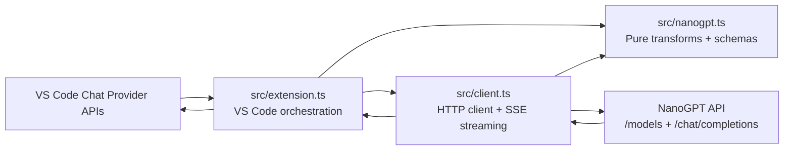

# Current Architecture

This document describes the architecture that is implemented today, not a proposed future design.

## System Goal

The extension registers NanoGPT as a VS Code Language Model Chat Provider so NanoGPT-backed models can appear in the Copilot Chat model picker and participate in VS Code chat requests.

At runtime, the extension translates between three worlds:

1. VS Code chat-provider APIs and request/response parts.
2. NanoGPT's OpenAI-compatible chat and model-discovery endpoints.
3. Internal repository contracts that separate VS Code integration, HTTP I/O, and pure transformation logic.

## High-Level Component Diagram

## Architectural Boundaries

### `src/extension.ts`

This file is the only place that should depend on VS Code runtime APIs.

Responsibilities:

- Registers the language model chat provider under vendor id `nanogpt`.
- Registers commands:
  - `nanogpt.manage`
  - `nanogpt.refreshModels`
- Resolves configuration from:
  - provider configuration
  - workspace settings
  - secret storage
  - environment fallback
- Bridges VS Code request message parts into the core `VscodeLikePart` format.
- Converts NanoGPT responses into VS Code response parts.
- Owns provider-level logging through the `NanoGPT` Output channel.
- Maintains per-key/per-routing-mode model cache.

Notable implementation details:

- The `NanoGPT` Output channel is created with `createOutputChannel(name, { log: true })`.
- Verbose diagnostics are gated by `nanogpt.verboseLogging`.
- Provider logic treats the absence of an API key as a recoverable runtime state and falls back to default or allowlisted models.
- `LanguageModelPromptTsxPart` is handled defensively via runtime feature detection.

### `src/client.ts`

This file owns network transport and stream handling.

Responsibilities:

- Builds outbound HTTP calls using `buildNanoGptChatCompletionRequest()` from the core layer.
- Calls:
  - `GET {baseUrl}/models?detailed=true`
  - `POST {baseUrl}/chat/completions`
- Composes timeouts with caller cancellation.
- Reads streaming SSE responses.
- Emits typed callbacks for text, reasoning, and tool calls.
- Produces sanitized transport logs through an injected logger interface.

Key design constraints:

- No VS Code imports.
- No direct knowledge of secret storage or workspace settings.
- Logging is transport-focused and intentionally sanitized.

### `src/nanogpt.ts`

This file is the pure core of the repository.

Responsibilities:

- Defines internal transport and transformation types.
- Converts VS Code-like messages into NanoGPT/OpenAI-compatible messages.
- Builds chat-completion request URLs, headers, and bodies.
- Maps raw model-discovery payloads to VS Code model metadata.
- Builds the per-model configuration schema.
- Parses SSE chunks into response parts.
- Estimates token counts heuristically.

Key property:

- This layer should stay pure and deterministic. It does not depend on VS Code or on network I/O.

## Manifest-Level Architecture

`package.json` defines the extension's runtime contract with VS Code.

Important manifest decisions:

- `type: module`
- `engines.vscode: ^1.105.0`
- `extensionKind: ["ui"]`
- `capabilities.untrustedWorkspaces.supported: false`
- activation on `onStartupFinished`
- provider contribution under `contributes.languageModelChatProviders`
- workspace settings under `contributes.configuration`

The provider contribution schema and the programmatic schema returned by `buildModelConfigurationSchema()` are intentionally coupled. The tests enforce that their property keys stay aligned.

## Runtime Objects

### Provider instance

`NanoGptLanguageModelProvider` is instantiated during activation and remains alive for the extension session.

It owns:

- `modelCache: Map<string, VscodeModelMetadata[]>`
- `nextRequestNumber` for request ids like `chat-3` or `discovery-2`
- references to:
  - `ExtensionContext`
  - `NanoGptClient`
  - shared logger

### Default model fallback

When discovery is unavailable, the provider exposes a fallback `gpt-5.4-mini` model with:

- `imageInput: true`
- `toolCalling: false`
- `reasoning: true`
- `internal.parallelToolCalls: false`
- provider configuration schema attached

This fallback exists to keep the provider usable even when discovery cannot run yet.

## Configuration Resolution Model

Configuration is layered rather than stored in a single object.

### API key precedence

Highest to lowest precedence:

1. provider configuration `apiKey`
2. VS Code secret storage `nanogpt.apiKey`
3. workspace/user setting `nanogpt.apiKey`
4. environment variable `NANOGPT_API_KEY`

### Routing mode precedence

1. provider configuration `routingMode`
2. workspace setting `nanogpt.routingMode`
3. implicit default `subscription`

### Other resolved settings

- `provider`
- `models` allowlist
- `reasoningEffort`
- `reasoningOutput`
- `verboseLogging`

The extension treats provider configuration as the most specific source because it is associated with the language-model provider flow in VS Code.

## Logging Architecture

Logging is centralized in the extension layer and fanned out into the client through an injected `NanoGptLogger`.

### Output surface

- Output channel name: `NanoGPT`
- Type: `LogOutputChannel`
- Timestamping: handled by VS Code log output channels

### Level usage

- `info`
  - extension activation
  - request start/complete summaries
  - model cache refresh command
  - API key save/clear events
- `warn`
  - missing API key
  - fallback model paths
  - response with no body
  - unsupported VS Code build capabilities
- `error`
  - model discovery failures
  - chat request failures
- `debug`
  - sanitized request configuration
  - transport request/response metadata
  - cache/result detail summaries
- `trace`
  - parsed stream counts
  - detailed model payload size counts

### Sanitization rules

The logger intentionally does not record:

- API keys
- prompt text
- full request bodies
- tool inputs
- tool result payloads

It does record safe summaries such as model ids, routing mode, counts, durations, and names of exposed tools.

## Request/Response Translation Model

The architecture depends on a two-step translation boundary.

### Step 1: VS Code -> internal core shape

`extension.ts` converts `LanguageModelChatRequestMessage` into a generic `VscodeLikeMessage`-compatible shape via `toCoreMessages()`.

That translation covers:

- text parts
- image data parts
- Prompt TSX parts when supported
- tool calls
- tool results

### Step 2: internal core shape -> NanoGPT message format

`toNanoGptMessages()` converts the generic shape into NanoGPT/OpenAI-compatible messages.

Important behaviors:

- numeric role `0` maps to `system`
- tool calls are emitted as assistant `tool_calls`
- tool results become `role: "tool"` messages
- mixed text + tool result user messages preserve text as a separate message before tool results
- non-image data is ignored for normal user message content

## Error-Handling Philosophy

The extension favors controlled degradation over hard failure where possible.

Examples:

- no API key during discovery: return fallback or allowlisted models
- discovery failure with cached models: reuse cache
- missing stream body: return without text instead of crashing
- malformed tool arguments: emit `{}`
- unsupported thinking-part API: degrade to text fallback only when `reasoningOutput === "visible"`

Hard failures remain for:

- missing API key at chat-request execution time
- non-OK HTTP chat responses
- oversized tool schema payloads

## Test Model

The automated tests intentionally split along the same architectural boundaries:

- `test/client.test.ts`
  verifies HTTP client behavior and sanitized logging.
- `test/nanogpt.test.ts`
  verifies pure transforms, request shaping, schema coupling, and parsing helpers.

There are no VS Code extension-host integration tests in the automated suite today. Those checks live in `docs/extension-host-smoke-test.md`.
