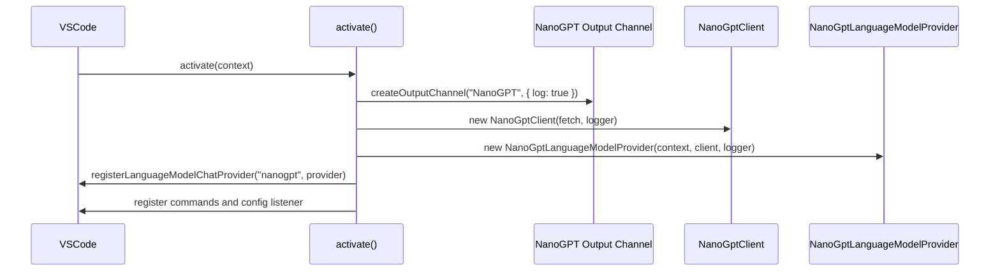
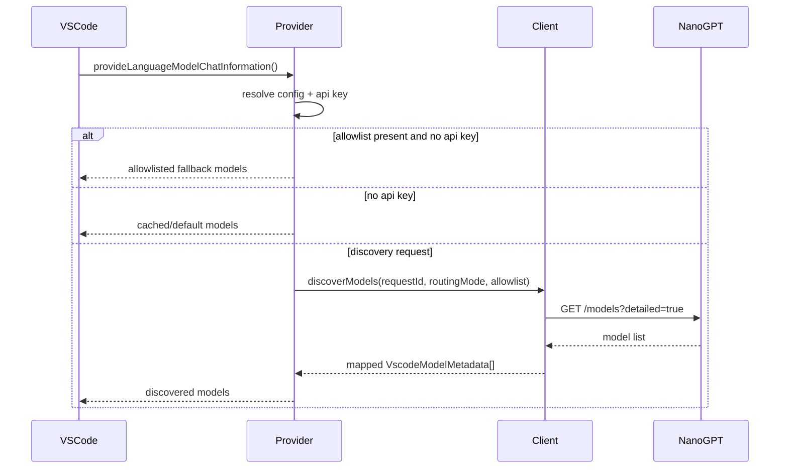
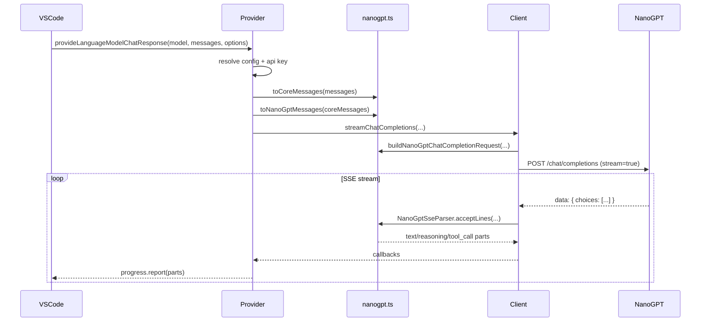

# Runtime Flows

This document describes the main runtime flows implemented in the extension.

## 1. Activation Flow

When VS Code activates the extension:

1. `activate(context)` runs in `src/extension.ts`.
2. A `LogOutputChannel` named `NanoGPT` is created.
3. A shared logger is built on top of that channel.
4. A `NanoGptClient` is created with the shared logger injected.
5. A `NanoGptLanguageModelProvider` is created.
6. The provider is registered through `vscode.lm.registerLanguageModelChatProvider` if the API exists.
7. Commands and configuration listeners are registered.



## 2. Model Discovery Flow

Discovery is exposed through `provideLanguageModelChatInformation()`.

### Normal flow

1. Generate a request id like `discovery-1`.
2. Resolve API key, routing mode, and optional model allowlist.
3. If an allowlist exists with no key, synthesize fallback models from the allowlist.
4. If no key exists at all, optionally trigger `nanogpt.manage` and return cached or default models.
5. Otherwise call `client.discoverModels()`.
6. Map raw NanoGPT entries to VS Code metadata.
7. Cache result by `${apiKey}|${routingMode}`.
8. Return discovered models, or default model if the list is empty.

### Transport details

- endpoint:
  - `https://nano-gpt.com/api/subscription/v1/models?detailed=true`
  - or `https://nano-gpt.com/api/v1/models?detailed=true`
- method: `GET`
- headers:
  - `Authorization: Bearer <apiKey>`
  - `Accept: application/json`

### Fallback behavior

- on discovery failure, cached models for that key/routing pair are reused if present
- otherwise `DEFAULT_MODELS` is returned



## 3. Chat Request Flow

Chat execution is exposed through `provideLanguageModelChatResponse()`.

### Request preparation

1. Generate request id like `chat-4`.
2. Resolve API key.
3. Fail immediately if no API key is available.
4. Resolve:
   - routing mode
   - provider
   - reasoning effort
   - reasoning output
   - max tokens
   - tool mode
5. Summarize input messages and tools for sanitized logging.
6. Convert VS Code messages to core messages with `toCoreMessages()`.
7. Convert core messages to NanoGPT/OpenAI-compatible messages with `toNanoGptMessages()`.

### Transport execution

1. `client.streamChatCompletions()` builds the final HTTP request.
2. The client performs a streaming `POST`.
3. The client reads the SSE body incrementally.
4. SSE deltas are converted to typed response parts.
5. The provider maps those parts to VS Code response parts and reports them via `progress.report(...)`.

### Response mapping

- text -> `LanguageModelTextPart`
- reasoning -> `LanguageModelThinkingPart` if available
- reasoning fallback -> `LanguageModelTextPart` only when configured as `visible`
- tool call -> `LanguageModelToolCallPart`



## 4. Request Shaping Flow

`buildNanoGptChatCompletionRequest()` is the only place that assembles the outbound request body.

It controls:

- base URL selection from routing mode
- `X-Provider` header for paygo mode
- `Accept: text/event-stream`
- `max_tokens`
- serialized tool schema
- `tool_choice: "required"`
- `parallel_tool_calls`
- `reasoning_effort`
- `reasoning.exclude`

Current reasoning behavior:

- `hidden` -> `reasoning: { exclude: true }`
- `native` or `visible` -> `reasoning: { exclude: false }`

## 5. Tool-Calling Flow

Tool support appears in three places.

### Input history translation

`toNanoGptMessages()` converts:

- assistant tool call parts -> OpenAI-compatible `tool_calls`
- tool result parts -> `role: "tool"`

### Outbound tool schema translation

`toNanoGptTools()` converts VS Code tool metadata to:

```json
{
  "type": "function",
  "function": {
    "name": "...",
    "description": "...",
    "parameters": { "type": "object", "properties": {} }
  }
}
```

The serialized tool payload is rejected if it exceeds 200 KB.

### Streamed tool call parsing

`NanoGptSseParser` accumulates partial tool-call chunks by index and flushes completed calls when:

- `finish_reason === "tool_calls"`, or
- `[DONE]` is received

If tool arguments fail JSON parsing, the extension degrades to `{}`.

## 6. Reasoning Flow

Reasoning is handled in both request shaping and response rendering.

### Request side

- `reasoningEffort` accepts:
  - `none`
  - `minimal`
  - `low`
  - `medium`
  - `high`
  - `xhigh`
- `auto` is local-only and means omission of `reasoning_effort`

### Response side

The SSE parser recognizes:

- `delta.reasoning`
- `delta.reasoning_content`
- `delta.thinking`

The provider then renders reasoning as:

- native thinking parts when supported
- normal text only in the `visible` fallback mode

## 7. Token Count Flow

`provideTokenCount()` is a thin wrapper over `estimateTokenCount()`.

Rules:

- string input -> roughly `ceil(length / 4)`
- request message input -> sum text lengths and add a flat 1024 tokens per image
- minimum result -> `1`

This is explicitly approximate and is not model-accurate.

## 8. Cancellation and Timeout Flow

Two cancellation systems are combined.

### Provider-level cancellation

`createAbortSignal(token)` mirrors a VS Code `CancellationToken` into an `AbortSignal`.

### Client-level timeout composition

`withTimeout(signal, timeoutMs)` combines:

- caller abort signal
- manual timer abort via `AbortController`

Timeouts in use:

- discovery: 30 seconds
- streaming chat: 5 minutes

The streaming reader always releases its lock in a `finally` block.

## 9. Logging Flow

Verbose and non-verbose logging follow the same shared logger interface.

### Non-verbose mode

Emits:

- `info`
- `warn`
- `error`

### Verbose mode

Also emits:

- `debug`
- `trace`

### Source ownership

- extension emits user-visible lifecycle summaries
- client emits lower-level HTTP and stream lifecycle details

All logs land in the same `NanoGPT` output channel.

## 10. Manual Verification Flow

The automated suite covers pure/core/client behavior, but not an extension host.

Manual extension-host verification lives in:

- `docs/extension-host-smoke-test.md`

That smoke test is the current source of truth for end-to-end validation inside a real VS Code host.
