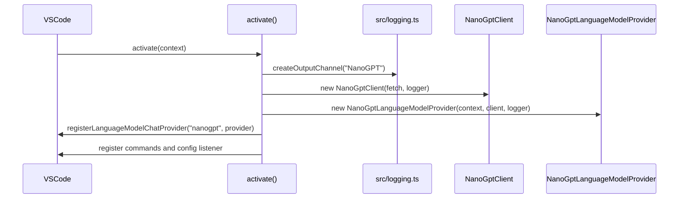
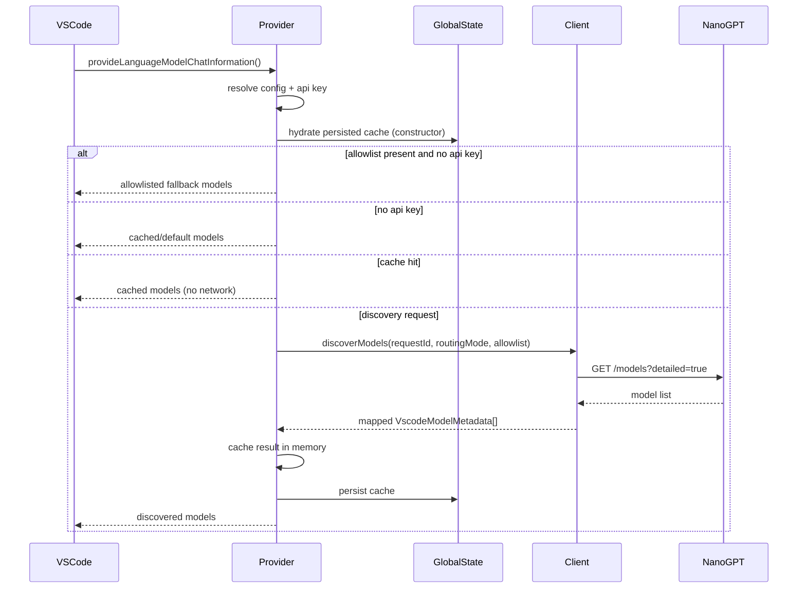
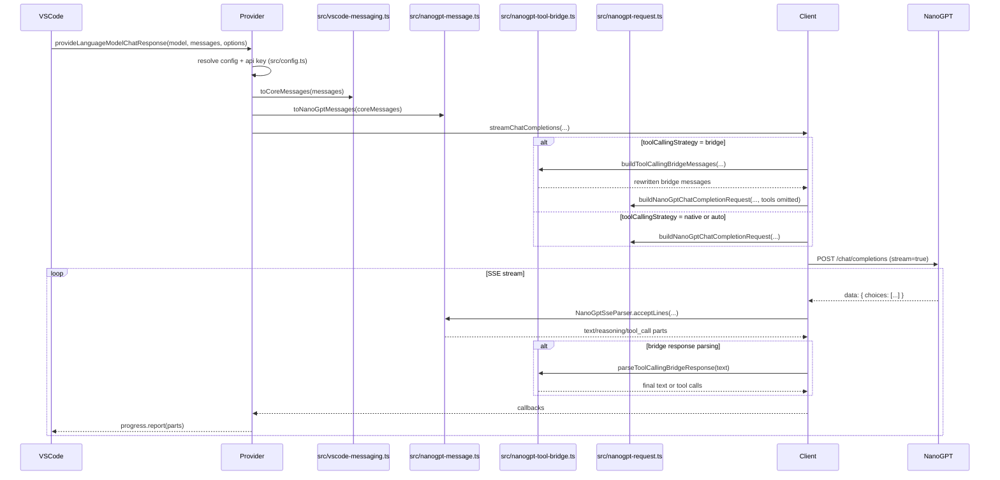

# Runtime Flows

This document describes the main runtime flows implemented in the extension.

## 1. Activation Flow

When VS Code activates the extension:

1. `activate(context)` runs in `src/extension.ts`.
2. A `LogOutputChannel` named `NanoGPT` is created via `src/logging.ts`.
3. A shared logger is built on top of that channel.
4. A `NanoGptClient` is created with the shared logger injected.
5. A `NanoGptLanguageModelProvider` is created.
6. The provider is registered through `vscode.lm.registerLanguageModelChatProvider` if the API exists.
7. Commands and configuration listeners are registered.
8. API-key updates, manual refreshes, and model-affecting `nanogpt.*` setting changes clear the discovery cache and fire `onDidChangeLanguageModelChatInformation` so VS Code re-queries the provider.



## 2. Model Discovery Flow

Discovery is exposed through `provideLanguageModelChatInformation()`.

### Normal flow

1. Generate a request id like `discovery-1`.
2. Resolve API key, routing mode, and optional model allowlist.
3. If an allowlist exists with no key, surface the same missing-key onboarding guidance and synthesize fallback models from the allowlist.
4. If no key exists at all, optionally trigger `nanogpt.manage` and return cached or default models.
5. Look up the in-memory model cache by `${routingMode}:${sha256Hex(apiKey)}[:allowlist]`. If populated (either from a prior successful discovery in this session or hydrated from `context.globalState` on activation), return it without calling the network.
6. Otherwise call `client.discoverModels()`.
7. Map raw NanoGPT entries to VS Code metadata.
8. Cache result by `${routingMode}:${sha256Hex(apiKey)}[:allowlist]` and persist the cache to `context.globalState`.
9. Return discovered models, or default model if the list is empty.

### Refresh triggers

- `nanogpt.manage` saves or clears the secret-stored API key, clears the discovery cache (in-memory and persisted), and fires the provider model-change event.
- `nanogpt.refreshModels` clears the discovery cache (in-memory and persisted) and fires the provider model-change event.
- Workspace configuration changes to `nanogpt.apiKey`, `nanogpt.routingMode`, or `nanogpt.models` clear the discovery cache (in-memory and persisted) and fire the provider model-change event. `nanogpt.provider` does not affect the discovery cache because `discoverModels` does not consume it; it is forwarded to chat-completion requests as the `X-Provider` header.

### Transport details

- endpoint:
  - `https://nano-gpt.com/api/subscription/v1/models?detailed=true`
  - or `https://nano-gpt.com/api/v1/models?detailed=true`
- method: `GET`
- headers:
  - `Authorization: Bearer <apiKey>`
  - `Accept: application/json`

### Fallback behavior

- on a cache hit, the cached models are returned without a network call
- on discovery failure, cached models for that key/routing pair are reused if present
- otherwise `DEFAULT_MODELS` is returned



## 3. Chat Request Flow

Chat execution is exposed through `provideLanguageModelChatResponse()`.

### Request preparation

1. Generate request id like `chat-4`.
2. Resolve API key.
3. Fail immediately if no API key is available.
4. Resolve routing mode, provider, reasoning effort, reasoning output, tool-calling strategy, max tokens, and tool mode.
5. Summarize input messages and tools for sanitized logging.
6. Convert VS Code messages to core messages with `toCoreMessages()`.
7. Convert core messages to NanoGPT/OpenAI-compatible messages with `toNanoGptMessages()`.

### Transport execution

1. `client.streamChatCompletions()` selects `native`, `auto`, or `bridge` tool-calling behavior; `native` is the default again, and `auto`/`bridge` are explicit opt-in.
2. The client builds the final HTTP request.
3. The client performs a streaming `POST` **with retry logic** (max 2 retries, exponential backoff with jitter). Transient failures (network errors, idle timeouts, 0-part responses) are retried automatically; non-retryable errors (auth, 4xx) propagate immediately.
4. The client reads the SSE body incrementally **with a 60-second per-chunk idle timeout**. If no data arrives within 60s, the read is aborted and may trigger a retry.
5. SSE deltas are converted to typed response parts. The parser tracks `finish_reason` and logs warnings for abnormal values (`"length"`, `"content_filter"`).
6. In `native` and `auto` modes with tools, thin scaffolding text (e.g. "Let me gather related files..") that precedes tool calls is suppressed from `progress.report()` to avoid triggering VS Code's Copilot Chat loop-detection guard on BYOK streams. Both modes share a unified `shouldBufferNativeTurn` buffering path.
7. In `auto`, a tool-enabled native turn that yields no tool calls and either no visible text or only likely scaffolding text is retried once with the bridge prompt.
8. The provider maps those parts to VS Code response parts and reports them via `progress.report(...)`.

### Response mapping

- text -> `LanguageModelTextPart`
- reasoning -> `LanguageModelThinkingPart` if available
- reasoning fallback -> `LanguageModelTextPart` only when configured as `visible`
- tool call -> `LanguageModelToolCallPart`



## 4. Request Shaping Flow

`buildNanoGptChatCompletionRequest()` is the only place that assembles the outbound request body.

It controls:

- base URL selection from routing mode
- `X-Provider` header for paygo mode
- `Accept: text/event-stream`
- `max_tokens`
- serialized tool schema
- `tool_choice: "required"`
- `parallel_tool_calls`
- `reasoning_effort`
- `reasoning.exclude`

Current reasoning behavior:

- `hidden` -> omit the `reasoning` field entirely
- `native` or `visible` -> `reasoning: { exclude: false }`

## 5. Tool-Calling Flow

Tool support appears in four places.

### Input history translation

`toNanoGptMessages()` converts:

- assistant tool call parts -> OpenAI-compatible `tool_calls`
- tool result parts -> `role: "tool"`

### Outbound tool schema translation

`toNanoGptTools()` converts VS Code tool metadata to:

```json
{
  "type": "function",
  "function": {
    "name": "...",
    "description": "...",
    "parameters": { "type": "object", "properties": {} }
  }
}
```

The serialized tool payload is rejected if it exceeds 200 KB.

### Optional bridge translation

`buildToolCallingBridgeMessages()` rewrites tool-enabled turns into a stricter JSON-only contract when `toolCallingStrategy` is `bridge`, or when `auto` retries an empty or likely scaffolding-only native tool turn.

Bridge behavior:

- system prompts are folded into one inherited bridge instruction
- assistant `tool_calls` history becomes assistant JSON text
- `role: "tool"` history becomes user-visible tool-result text with an anti-repeat instruction
- native `tools`, `tool_choice`, and `parallel_tool_calls` are omitted from the retried bridge request
- malformed bridge replies get one JSON-only repair retry. Bridged-turn reasoning deltas are buffered per-turn and only emitted on the final committed turn (not on discarded repair retries). If `toolMode: "required"` still omits usable tool calls after repair, the client returns `requiredToolWarning` and the provider emits it as a warning `LanguageModelTextPart` instead of surfacing raw prose

### Streamed tool call parsing

`NanoGptSseParser` accumulates partial tool-call chunks by index and flushes completed calls when:

- `finish_reason === "tool_calls"`, or
- `[DONE]` is received, or
- the stream reaches EOF and `flushPendingToolCalls()` is called

If tool arguments fail JSON parsing, the extension degrades to `{}`.

## 6. Reasoning Flow

Reasoning is handled in both request shaping and response rendering.

### Request side

- `reasoningEffort` accepts:
  - `none`
  - `minimal`
  - `low`
  - `medium`
  - `high`
  - `xhigh`
- `auto` is local-only and means omission of `reasoning_effort`
- invalid non-`auto` values trigger a one-time deduplicated warning (per provider instance lifetime) and fall back to omitting `reasoning_effort`

### Response side

The SSE parser recognizes:

- `delta.reasoning`
- `delta.reasoning_content`
- `delta.thinking`

The provider then renders reasoning as:

- native thinking parts when supported
- normal text only in the `visible` fallback mode

## 7. Token Count Flow

`provideTokenCount()` is a thin wrapper over `estimateTokenCount()`.

Rules:

- string input -> roughly `ceil(length / 4)`
- request message input -> sum text lengths and add a flat 1024 tokens per image
- when tool definitions are provided, also add approximate tokens for each tool's name, description, and input schema
- minimum result -> `1`

This is explicitly approximate and is not model-accurate.

## 8. Cancellation and Timeout Flow

Two cancellation systems are combined.

### Provider-level cancellation

`createAbortSignal(token)` mirrors a VS Code `CancellationToken` into an `AbortSignal`.

### Client-level timeout composition

`withTimeout(signal, timeoutMs)` combines:

- caller abort signal
- manual timer abort via `AbortController`

Timeouts in use:

- discovery: 30 seconds
- streaming chat: 5 minutes (global safety net)
- **per-chunk idle timeout: 60 seconds** (resets on each successful chunk read)

The per-chunk idle timeout prevents silent hangs when the server stops sending data without closing the connection. If no data arrives within 60 seconds, the stream read is aborted and the retry logic (see below) may attempt recovery.

### Stream retry logic

`streamChatCompletions()` wraps native streaming calls in a retry loop with exponential backoff:

- **Max retries**: 2 attempts (3 total tries)
- **Backoff**: 500ms → 1s → 2s (capped at 5s), with ±25% jitter
- **Retry triggers**:
  - Transient network errors (fetch failures, connection resets, timeouts)
  - Idle timeout (no data for 60s)
  - 0-part responses (server returned 200 OK but sent no text, reasoning, or tool calls)
- **Non-retryable errors**: Auth failures (401), bad requests (4xx), already-aborted signals
- **Cancellation-aware**: Retry backoff waits respect the abort signal and exit immediately if cancelled

The retry loop clears buffered parts on each attempt to avoid duplicate text emission. Bridge mode and auto-bridge retries are not retried at the outer loop (they have their own internal retry semantics).

### finish_reason validation

The SSE parser tracks the last `finish_reason` seen in the stream. Abnormal values are logged as warnings and exposed in `StreamProcessingSummary.finishReason`:

- `"length"` — response was truncated (hit max_tokens)
- `"content_filter"` — response was refused by upstream content policy

Normal values (`"stop"`, `"tool_calls"`, `undefined`) do not trigger warnings. This allows callers to distinguish normal completions from truncated or refused responses.

## 9. Logging Flow

Verbose and non-verbose logging follow the same shared logger interface.

### Non-verbose mode

Emits:

- `info`
- `warn`
- `error`

### Verbose mode

Also emits:

- `debug`
- `trace`

### Source ownership

- extension emits user-visible lifecycle summaries
- client emits lower-level HTTP and stream lifecycle details

All logs land in the same `NanoGPT` output channel.

## 10. Manual Verification Flow

The automated suite covers pure/core/client behavior, but not an extension host.

Manual extension-host verification lives in:

- `docs/extension-host-smoke-test.md`

That smoke test is the current source of truth for end-to-end validation inside a real VS Code host.
